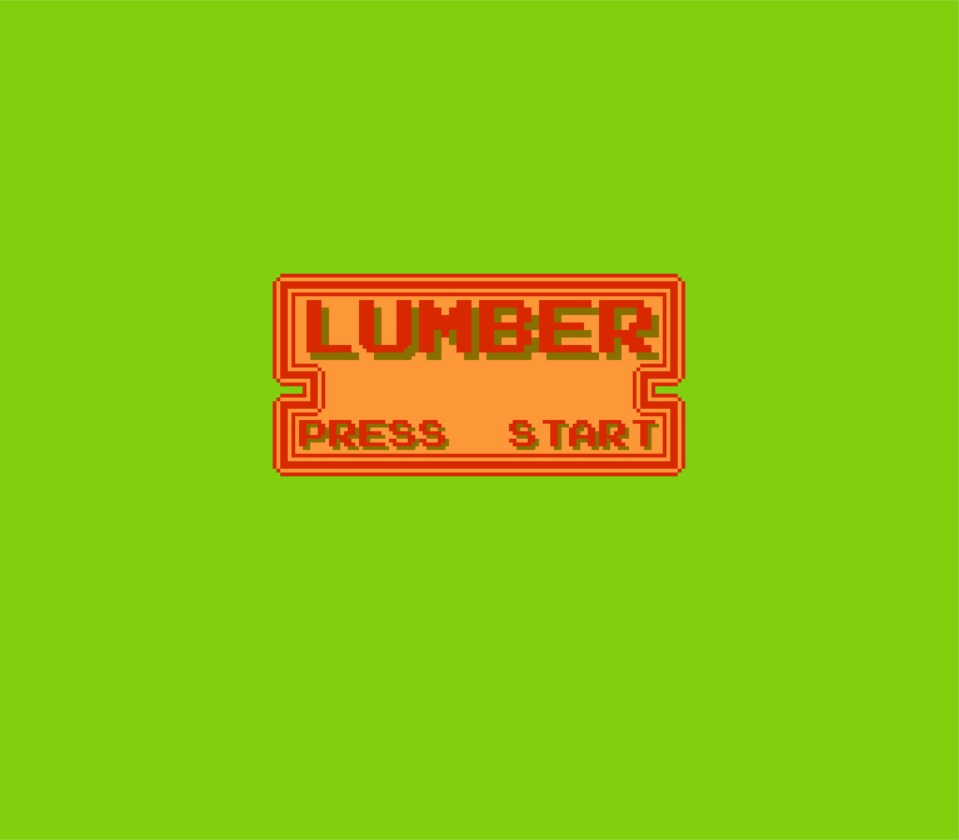
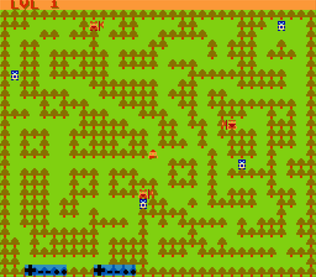

# Lumber 6502
### Cut Trees, Grow Your Beard, Fight Aliens

**Roadmap:**
- Chop/attack
  - logic needs to update PPU to destroy trees
  - applied to all player sides
  - add macro for chop or rework TileTranslate macro
  - Attack logic rework to activate once/button press
- RLE background decompression needs to work with new bg memory location
- Gameover Logic
  - Screen and restart
- Objects/Graphics
  - Add rock object
  - Different types of enemies
______________________________________________________________________________________________________________________________________________
- Object Collection routine
  - scoring system
- Random background genereation
  - percentages for objects (trees, rocks, enemies)
- Enemies
  - New roam routines
  - Enemy attack/destroy trees

